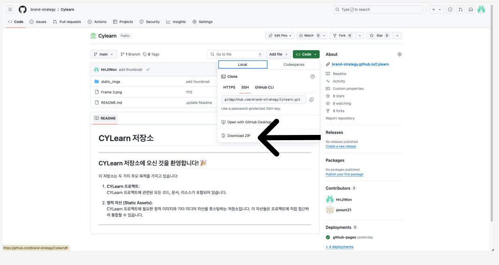
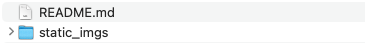
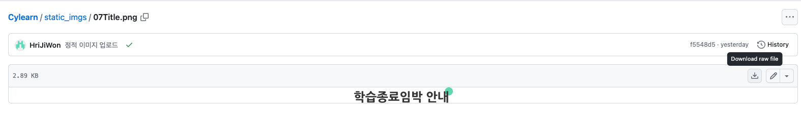
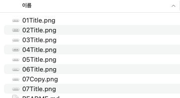
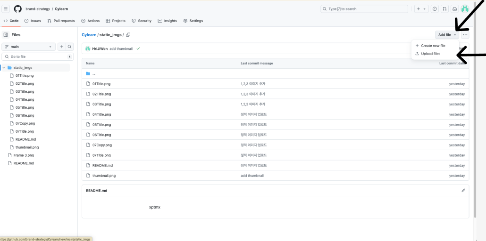
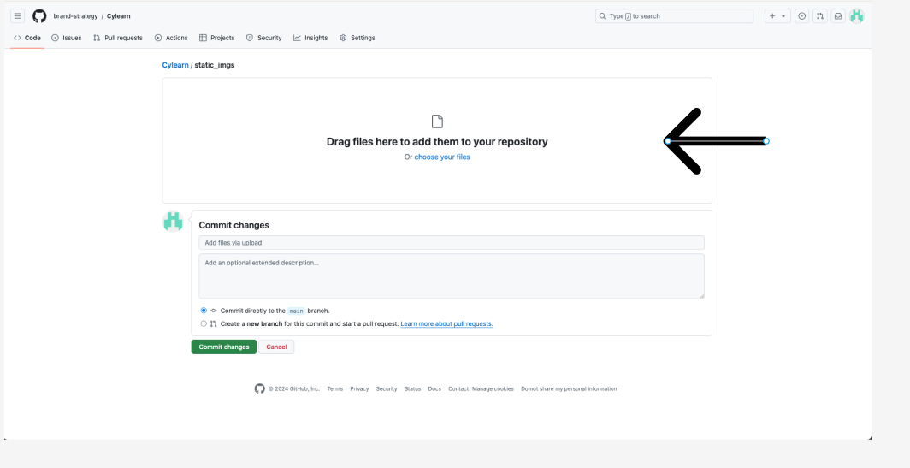
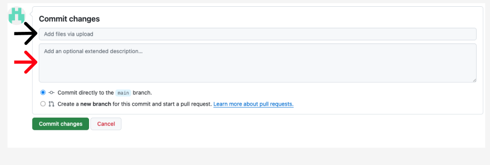

# CYLearn 저장소 안내

## CYLearn 저장소에 오신 것을 환영합니다! 🎉

CYLearn 저장소는 다음 두 가지 주요 목적을 가지고 있습니다:

1. **CYLearn 프로젝트**: 프로젝트 관련 코드, 문서, 리소스를 포함합니다.
2. **정적 자산 (Static Assets)**: 프로젝트 필요한 정적 이미지 및 기타 미디어 자산을 호스팅합니다. 이 자산들은 프로젝트에 직접 통합 가능합니다.

---

## 이미지 다운로드 및 사용 방법

### 이미지 다운로드
이미지를 다운로드하기 위한 단계별 지침입니다:

1. **Code 버튼 클릭**:
   
   
2. **Download ZIP 버튼 클릭**:
   
   
3. **ZIP 파일 풀기**:
   다운로드 받은 ZIP 파일을 풀면 `static_imgs` 폴더가 있습니다.
   
4. **단일 파일 다운**:
   만약 파일을 전부 다 받지 않고 하나씩 받고 싶다면
   원하는 파일 경로에 들어와서
   
   사진 속 다운로드 버튼을 클릭 하면 됩니다.
### 이미지 사용 방법

`static_imgs` 폴더 안에 포함된 이미지 파일들은 웹 페이지나 문서에서 쉽게 사용할 수 있습니다. 다음은 이미지를 사용하는 방법에 대한 단계별 안내입니다:



이미지 파일을 웹에서 참조하려면 다음과 같이 웹 주소를 사용할 수 있습니다:

- **특정 이미지 참조 예시**:
  - `01Title.png` 이미지 주소:
    ```
    https://brand-strategy.github.io/Cylearn/static_imgs/01Title.png
    ```

- **일반 형식**:
  파일 이름과 확장자를 사용하여 주소를 구성할 수 있습니다:
    ```
    https://brand-strategy.github.io/Cylearn/static_imgs/파일이름.파일확장자
    ```

이 방법을 사용하면 웹 페이지에서 직접 이미지를 불러올 수 있으며, 링크를 통해 이미지에 접근할 수도 있습니다.


---

## 이미지 추가 방법

### 파일 업로드
GitHub 저장소에 이미지를 추가하는 방법은 다음과 같습니다:

1. **저장소 경로 입장**:
 [CYLearn 이미지 저장소](https://github.com/brand-strategy/Cylearn/tree/main/static_imgs)로 이동합니다.

2. **파일 업로드**:
 - **Add file 버튼 클릭**:
   
 - **Upload Files 선택**:
   

3. **파일 업로드 및 커밋**:
 파일을 선택하고 드래그 앤 드랍하여 업로드합니다.
 

4. **커밋 메시지 작성**:
 파일 업로드 후 "commit Changes" 버튼을 클릭하여 변경사항을 커밋합니다.
 - 제목(검은색 화살표): 간단한 변경 내용 (예: "OO 이미지 업로드")
 - 설명(빨간색 화살표): 필요한 경우 추가 설명 (예: 파일에 대한 상세 정보)
 - Commit Changes 버튼을 클릭하면 최종적으로 이미지가 업로드 됩니다.
 

---
