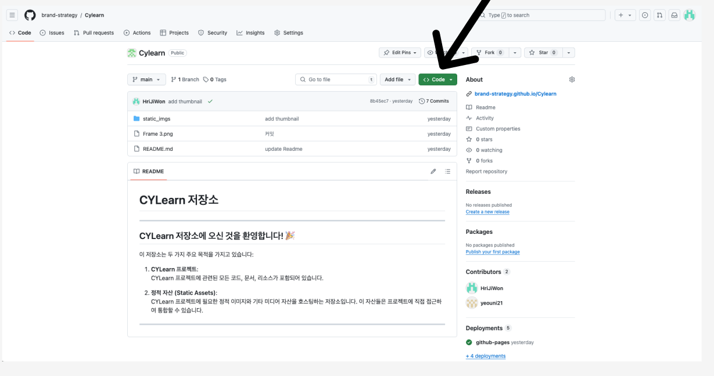

# CYLearn 저장소

---

## CYLearn 저장소에 오신 것을 환영합니다! 🎉

이 저장소는 두 가지 주요 목적을 가지고 있습니다:

1. **CYLearn 프로젝트**:  
   CYLearn 프로젝트에 관련된 코드, 문서, 리소스가 포함되어 있습니다.

2. **정적 자산 (Static Assets)**:  
   CYLearn 프로젝트에 필요한 정적 이미지와 기타 미디어 자산을 호스팅하는 저장소입니다. 이 자산들은 프로젝트에 직접 접근하여 통합할 수 있습니다.

---

## 이미지 다운로드 방법 및 사용방법

### 1.Code 버튼을 클릭합니다. 

### 2. Download ZIP 버튼을 클릭합니다.

### 3. 다운받은 ZIP 파일을 풀어주면 static_imgs 폴더가 있습니다.

### 4. 사용방법

static_imgs 폴더를 확인하면 위와 같은 사진들을 확인 할 수 있습니다.
저장된 이미지 주소를 확인하고 싶다면 아래와 같이 사용할 수 있습니다.
> 예시 01Title.png 이미지 주소를 확인하고싶다면 
 https://brand-strategy.github.io/Cylearn/static_imgs/01Title.png
 즉. https://brand-strategy.github.io/Cylearn/static_imgs/파일이름.파일확장자
 이렇게 사용 할 수 있습니다.

## 이미지 추가 방법

### 1. 이미지를 저장한 저장소 경로에 입장합니다.
아래 주소 입니다.
https://github.com/brand-strategy/Cylearn/tree/main/static_imgs

### 2. 파일 업로드 과정
   1. Add file 버튼을 클릭합니다.
   2. Upload Files 버튼을 클릭합니다.

### 3. 파일 업로드 및 커밋
   1. 2번 과정을 마무리 했으면 아래 사진이 나오게 되는데
   파일 이름을 지정한 상태로 화살표 표시한 곳에 드래그 앤 드랍 및 클릭하여 파일을 업로드 할 수 있습니다.

### 4.커밋
3번과정속 파일을 업로드하고 commit Changes라는 버튼을 클릭하면 업로드 하게 됩니다.
커밋 메세지는 쓰지 않아도 무방하나
만약 쓰게 된다면 검정색 화살표 부분이 제목
빨간색 화살표 부분은 설명인데 
제목이 너무 길어질 경우 설명에서 추가 설명을 할 수 있습니다.

파일만 단순히 올리는 것이라면
제목에 OO이미지 업로드 라고 커밋하고 업로드 해주시면 됩니다.

